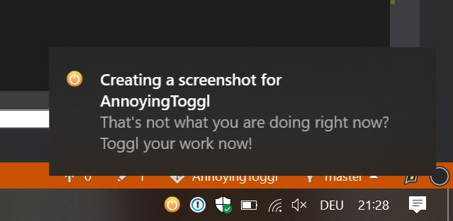

# AnnoyingToggl

Reminds you of your current Toggl timer every 5 minutes - it's annoying but works!

## Introduction

If you are using [Toggl](https://toggl.com/) you will know this situation:
You are working on your own - suddenly a meeting starts. Of course you forgot to update your Toggl timer.
Right after the meeting you notice your mistake, dammit! Now you have to manually correct the running timer and add a new time entry for the meeting. **AnnoyingToggl** to the rescue!

**AnnoyingToggl** reminds you every 5 minutes of your currently running timer by showing an annoying balloon notification to you. As long as you are sitting in front of your computer, you won't miss toggling again. :-)

## Getting Started

1. Download the [latest **AnnoyingToggl** release](https://github.com/selmaohneh/AnnoyingToggl/releases) or clone the repository and build the project yourself!
2. Head to [https://toggl.com/app/profile](https://toggl.com/app/profile) and get your Toggl API token.
3. Start **AnnoyingToggl** with your Toggl API token as argument.
4. Happy toggling!
